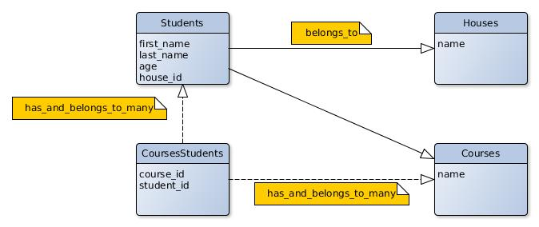

#Relational DB & ORM

Basic Consent & Terminologies
-----------------------------

##### What is RDBMS?
RDBMS stands for **Relational Database Management System**.
RDBMS is the basis for SQL, and for all modern database systems like MS SQL Server, Postgres, sqlite...

##### What is SQL?
SQL stands for **Structured Query Language**, which is a computer language for storing, manipulating and retrieving data stored in relational database.

##### What is Table?
A table is the most common and simplest form of data storage in a relational database.

##### What is record/row?
A record, also called a row of data, is each individual entry that exists in a table.

##### What is column?
A column is a vertical entity in a table that contains all information associated with a specific field in a table.

| id | first_name | last_name | catch_phrase       |               |
|----|------------|-----------|--------------------|---------------|
| 1  | johny      | bravo     | man I'm pretty     | <- record/row |
| 2  | elmaer     | fudge     | be vewi vewi quiet |               |
| 3  | ...        | ...       | ...                |               |
|    |            |           | ^ column           |               |

##### What is ORM?
**Object-Relational Mapping**, commonly referred to as its abbreviation ORM, is a technique that connects the rich objects of an application to tables in a relational database management system. Using ORM, the properties and relationships of the objects in an application can be easily stored and retrieved from a database **without writing SQL statements directly** and with less overall database access code.
For example, ActiveRecord (at rails apps) & Ecto (at PhoenixFramework).

------------------------------------------------------------------------------------------------------------------------

Migrations & Schema
-------------------
Migrations are a convenient way to alter your database over time in a consistent and easy way. They use Ruby code so that you don't have to edit tables by SQL.

Migrations, mighty as they may be, are not the authoritative source for your database schema. That role is in the hands of db/schema.rb, which shows the db current state.

For example, the migration
```Ruby
class CreateStudents < ActiveRecord::Migration
  def change
    create_table :students do |t|
      t.string :first_name
      t.string :last_name
      t.integer :age
      t.belongs_to :house
      t.timestamps
    end
  end
end
```

will be translated to schema.rb as
```Ruby
  create_table "students", force: :cascade do |t|
    t.string   "first_name"
    t.string   "last_name"
    t.integer  "age"
    t.integer  "house_id"
    t.datetime "created_at"
    t.datetime "updated_at"
  end
```

------------------------------------------------------------------------------------------------------------------------

Queries
-------
Lets review some basic AR code, and its SQL interpretation.

#####Insert
The INSERT INTO Statement is used to add new rows of data to a table in the database.

```Ruby
  Student.create(first_name: "Johny", last_name: "Bravo", age: 25)
```
```SQL
  INSERT INTO students (first_name, last_name, age) VALUES ('Johny', 'Bravo', 25)
```

#####Select
SELECT statement is used to fetch the data from a database table which returns data in the form of result table. These result tables are called result-sets.

```Ruby
  Student.first
```
```SQL
  SELECT * FROM students ORDER BY id LIMIT 1
```

##### Where
The WHERE clause is used to specify a condition while fetching the data from single table or joining with multiple tables.

```Ruby
  Student.where('age < 30')
```
```SQL
  SELECT * FROM students WHERE age < 30
```

```Ruby
  Student.where("first_name LIKE (?)", "%Har%")
```
```SQL
  SELECT students.* FROM students WHERE (first_name LIKE ('%Har%'))
```

##### Composed Queries
You can chain AR queries. AR will analyze the code, and convert it to one or more SQL queries.

```Ruby
  Student.where('age < 30').select(:first_name, :last_name)
```

```SQL
  SELECT first_name, last_name FROM students WHERE age < 30
```

##### Join
An SQL JOIN clause is used to combine rows from two or more tables, based on a common field between them.

The most common type of join is INNER JOIN (simple join). An SQL INNER JOIN returns all rows from multiple tables where the join condition is met.

Say we have 2 tables
Students:

| id | first_name | last_name | catch_phrase       | house_id |
|----|------------|-----------|--------------------|----------|
| 1  | johny      | bravo     | man I'm pretty     | 1        |
| 2  | elmaer     | fudge     | be vewi vewi quiet | 2        |
| 3  | ...        | ...       | ...                |          |
|    |            |           |                    |          |

Houses:

| id | city | street   | number |
|----|------|----------|--------|
| 1  | NY   | Broadway | 1      |
| 2  | NY   | 5th      | 4      |
| 3  | ...  | ...      | ...    |
|    |      |          |        |

We want to get a list of [student_id, house_id]

```SQL
  SELECT students.*, houses.*
  FROM students
  INNER JOIN houses
  ON students.house_id = houses.id
```
Note that we don't really need to pull each student & houses data into memory. We can specify which fields are required for our purpose.
More about that at the `best practices` section.
```SQL
  SELECT students.id as student_id , houses.number as houses_number
  FROM students
  INNER JOIN houses
  ON students.house_id = houses.id
```

Result:

| student_id | house_number |
|------------|--------------|
| 1          | 1            |
| 2          | 4            |
| 3          | ...          |
|            |              |

--------------------------------------------------------------------------------------------

Relations
---------
Relations between tables can be defined using secondary indexes.
For example, at the AR migration below, `belongs_to :house` simply adds a house_id column at that student table.
```Ruby
class CreateStudents < ActiveRecord::Migration
  def change
    create_table :students do |t|
      t.string :first_name
      t.string :last_name
      t.integer :age
      t.belongs_to :house
      t.timestamps
    end
  end
end
```

We also want to be able to add this student-house functionality to the Student Model:

```Ruby
  class Student < ActiveRecord::Base
    belongs_to :house

    def my_house_name
      house.name
    end

    def self.first_student_house_name
      Student.first.house.name
    end
  end
```

Many-to-many relations require an intimidate tables. So if a Student can take many courses & each course has many students - we need to such table one. Note that at intimidate tables, id column is not mandatory.
```Ruby
  class CreateCoursesStudents < ActiveRecord::Migration
    def change
      create_table :courses_students do |t|
        t.belongs_to :student, index: true
        t.belongs_to :course, index: true
      end
    end
  end
```
Now we can add functionality to our models:
```Ruby
  class Student < ActiveRecord::Base
    belongs_to :house
    has_and_belongs_to_many :courses

    def first_course
      courses.first
    end
  end
  
  class Course < ActiveRecord::Base
    has_and_belongs_to_many :students
    
    def sort_students_by_id
      students.sort
    end
  end
```




--------------------------------------------------------------------------------------------

Sequences
---------
By default tables are created with an primary `id` integer column. The value of this this filed is determined by the table `sequence`.
This is what makes sure ids are unique and not null, as primary keys requires.

Some DB's allows us to create a costume sequence. Assuming we use Postgres, we want models Potion & Charms that share an unique magical_id, and use that as our primary key.

First we'll define the migrations
```Ruby
  class CreateMagicalSequence < ActiveRecord::Migration
    def change
      execute "CREATE SEQUENCE magical_seq INCREMENT BY 1 START WITH 1000"
    end
  end

  class CreatePotions < ActiveRecord::Migration
    def change
      execute "CREATE TABLE potions(magical_id INTEGER DEFAULT NEXTVAL('magical_seq'), name VARCHAR(32));"
    end
  end

  class CreateCharms < ActiveRecord::Migration
    def change
      execute "CREATE TABLE charms(magical_id INTEGER DEFAULT NEXTVAL('magical_seq'), name VARCHAR(32));"
    end
  end
```

Then set AR models to use 'magical_id' as primary key.
```Ruby
  class Potion < ActiveRecord::Base
    self.primary_key = 'magical_id'
  end
  class Charm < ActiveRecord::Base
    self.primary_key = 'magical_id'
  end
```

Now we can run something like
```Ruby
  Potion.create(name: 'p1').magical_id
  # => 1000
  Charm.create(name: 'c1').magical_id
  # => 1001
  Charm.create(name: 'c1').magical_id
  # => 1002
  Potion.create(name: 'p2').magical_id
  # => 1003
```
------------------------------------------------------------------------------------------------------------------------

Best Practices
--------------

#### Use AR built in queries
ActiveRecord has a lot of built-in functionality we can use.
```Ruby
  Course.ids
  Student.count
  House.exists?
```

#### Keep code conversions
AR will convert different queries to the same SQL. It's easier to follow when we use the same patterns everywhere.

```Ruby
  House.where(name: 'house_name').first # bad
  House.find_by_name('house_name') # bad
  House.find_by(name: 'house_name') # good
```
```SQL
  SELECT  houses.* FROM houses WHERE houses.name = 'house_name' LIMIT 1
```

#### Minimize the number of DB connections
Use arrays at queries.
```Ruby
  # bad
  s1 = Student.find(1)
  s2 = Student.find(5)
  s3 = Student.find(23)
  # good
  Student.where(id: [1, 5, 23])
```
```SQL
 SELECT students.* FROM students WHERE students.id IN (1, 5, 23)
```

Use find_or_create
```Ruby
  emails = %w(mama@email.com papa.email.com)
  # not so good
  emails.each do |e| 
    u = User.find_by_email(e)
    unless u User.create(email: e)
  end
  # better
  emails.each {|e| User.find_or_create_by(email: e)}
```

#### Bulk actions
Each time you insert data to a table there are a few things going on. Creating a connection to the DB is an expensive action. Not only that, chances are the DB is on a remote system somewhere, so we need to think about network overhead too.

AR has some built-in bulk actions such as `update_all, destroy_all...`
```Ruby
  def add
    i = Student.count
    Student.create(first_name: "fname_#{i}", last_name: "lname_#{i}", age: AGE_RANGE.sample)
  end

  # VERY BAD!
  def bulk_insert(n)
    (1..n).each { add }
  end

  # better...
  def bulk_insert(n)
    c = Student.count
    ActiveRecord::Base.transaction do
      (c + 1.. c + n).each { |i| Student.create(first_name: "fname_#{i}", last_name: "lname_#{i}", age: AGE_RANGE.sample) }
    end
  end

  # Even Better!
  def bulk_insert(n)
    c = Student.count
    values = (c + 1..c + n).map { |i| "('fname_#{i}', 'lname_#{i}', #{AGE_RANGE.sample})" }.join(', ')
    sql = "INSERT INTO students (first_name, last_name, age) VALUES #{values}"
    ActiveRecord::Base.connection.execute(sql)
  end
```

#### Avoid N+1 queries
Lets consider this code, what is the time complexity?
```Ruby
  students = Student.where("first_name LIKE (?)", "%H%")
  students.each {|s| s.house}
```

Now look at the console logs:
```Ruby
  2.3.0 :004 > students = Student.where("first_name LIKE (?)", "%H%")
    Student Load (0.5ms)  SELECT "students".* FROM "students" WHERE (first_name LIKE ('%H%'))

  2.3.0 :005 > students.each {|s| s.house}
    House Load (0.1ms)  SELECT  "houses".* FROM "houses" WHERE "houses"."id" = ? LIMIT 1  [["id", 1]]
    House Load (0.0ms)  SELECT  "houses".* FROM "houses" WHERE "houses"."id" = ? LIMIT 1  [["id", 1]]
    House Load (0.0ms)  SELECT  "houses".* FROM "houses" WHERE "houses"."id" = ? LIMIT 1  [["id", 3]]
    House Load (0.0ms)  SELECT  "houses".* FROM "houses" WHERE "houses"."id" = ? LIMIT 1  [["id", 3]]
    House Load (0.0ms)  SELECT  "houses".* FROM "houses" WHERE "houses"."id" = ? LIMIT 1  [["id", 3]]
    House Load (0.0ms)  SELECT  "houses".* FROM "houses" WHERE "houses"."id" = ? LIMIT 1  [["id", 1]]
    House Load (0.0ms)  SELECT  "houses".* FROM "houses" WHERE "houses"."id" = ? LIMIT 1  [["id", 3]]
    House Load (0.0ms)  SELECT  "houses".* FROM "houses" WHERE "houses"."id" = ? LIMIT 1  [["id", 4]]
    House Load (0.0ms)  SELECT  "houses".* FROM "houses" WHERE "houses"."id" = ? LIMIT 1  [["id", 2]]
    House Load (0.0ms)  SELECT  "houses".* FROM "houses" WHERE "houses"."id" = ? LIMIT 1  [["id", 1]]
    House Load (0.0ms)  SELECT  "houses".* FROM "houses" WHERE "houses"."id" = ? LIMIT 1  [["id", 2]]
    House Load (0.0ms)  SELECT  "houses".* FROM "houses" WHERE "houses"."id" = ? LIMIT 1  [["id", 3]]
```

Smells Bad aha?

**Eager loading** is AR mechanism for loading the associated records of the objects returned by Model.find using as few queries as possible.

Lets see what happens when we use the *includes* method
```Ruby
  2.3.0 :006 > students = Student.includes(:house).where("first_name LIKE (?)", "%H%")
    Student Load (0.5ms)  SELECT "students".* FROM "students" WHERE (first_name LIKE ('%H%'))
    House Load (0.2ms)  SELECT "houses".* FROM "houses" WHERE "houses"."id" IN (1, 3, 4, 2)
```
This code will send only 2 queries to the db. AR loaded the needed Houses to memory too. Running the `students.each` loop will not access the db.

You can also reduce time complexity by covering pure ruby logic down to db queries.
For example say we want to get tuples of {student_first_name, student_last_name, course_name} for each student & his courses.
```ruby
  def students_names_and_courses
    Student.all.map do |s|
      res = []
      s.courses.each do |c| res.push({
        first_name: s.first_name,
        last_name: s.last_name,
        course_name: c.name
        })
      end
      res
    end
  end
```
We can do that by a single SQL query
```SQL
  SELECT students.first_name as first_name, students.last_name as last_name, courses.name as course_name
  FROM courses_students 
  JOIN courses ON courses_students.course_id = courses.id
  JOIN students  ON courses_students.student_id = students .id
```

###### Minimize memory usage
Every time we make a query, we get back an ActiveRecord::Relation object. Sometimes those objects can be pretty big. Use `select` to make then thin, or even better, use pluck!

Say we wanna do some calculations on our students ages
```
 # bad - keeping unnecessary data in memory
 ages = []
 students = Student.all
 students.each {|s| arr.push(s.age)}
 do_some_calcs_on(ages)

# better, but still bad - minimize the object size.
 ages = []
 Student.all.select(:age)
 students.each {|s| arr.push(s.age)}
 do_some_calcs_on(s.pluck(ages)

 # better - don't keep the object at memory at all!
 ages = Student.pluck(:age)
 do_some_calcs_on(ages)
```

You can also use `limit` to get the same effect. Say we want to get our 3 oldest students.
```Ruby
  # bad - doing the calculations in memory
  students = Student.all.sort_by{|s| s.age}.take 3
  # => SELECT "students".* FROM "students" ...
  # better - let the DB do the work
  Student.where('age > 17').order(:age).limit 3
  # => SELECT  "students".* FROM "students" WHERE (age > 17)  ORDER BY "students"."age" ASC LIMIT 3 ...
```

------------------------------------------------------------------------------------------------------------------------

####Recurses

- http://www.tutorialspoint.com/sql/index.html
- http://guides.rubyonrails.org/active_record_querying.html
- http://guides.rubyonrails.org/active_record_querying.html#eager-loading-associations
- http://www.toptal.com/ruby-on-rails/top-10-mistakes-that-rails-programmers-make